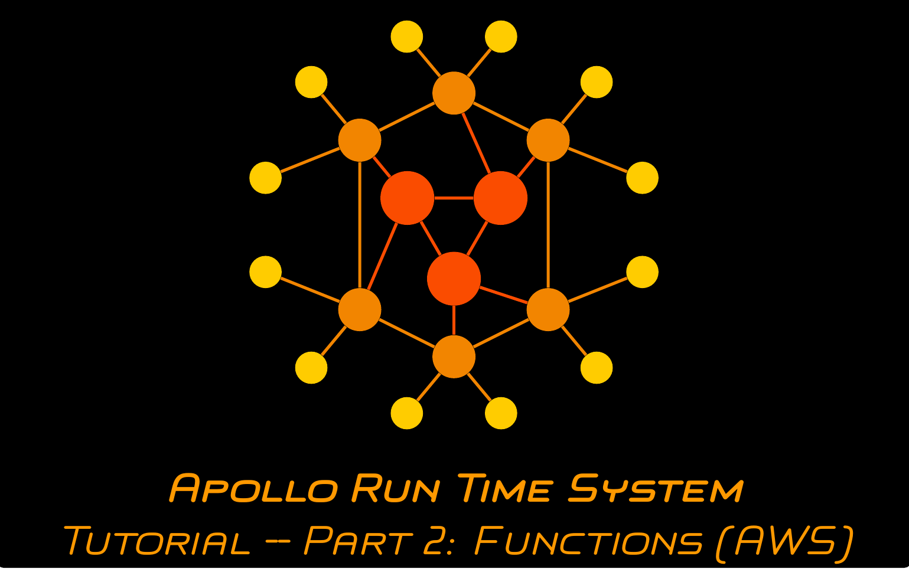

# Apollo Run Time System Tutorial -- Part 2: Implementing and Deploing Serverless Function Resources

This repository provides a possible solution for the second part of the tutorial series on the Apollo Run Time System. In this tutorial, you will use [Apollo's deployment process](https://github.com/Apollo-Functions/FunctionTemplate) to implement and deploy the functions of the caesar cipher application as serverless functions on AWS.

## Video

The content and a walkthrough for this part of the tutorial is provided in the following video (click the image):

## Content

### Start

This folder contains the files representing the necessary knowledge about the application which is about to be orchestrated:

- The file ``Caesar.yaml`` (created in the [first part of the tutorial](https://github.com/Apollo-Core/Tutorial/tree/master/Part_1)) which describes the workflow of the application orchestrated in this tutorial
- The file ``functions.py`` containing a standalone implementation of the functionality which is to be deployed as a serverless function usable by Apollo

### Result

The ``typeMappings.json`` file which contains the links to the serverless functions deployed on AWS (your links will differ from the ones provided in the repository).