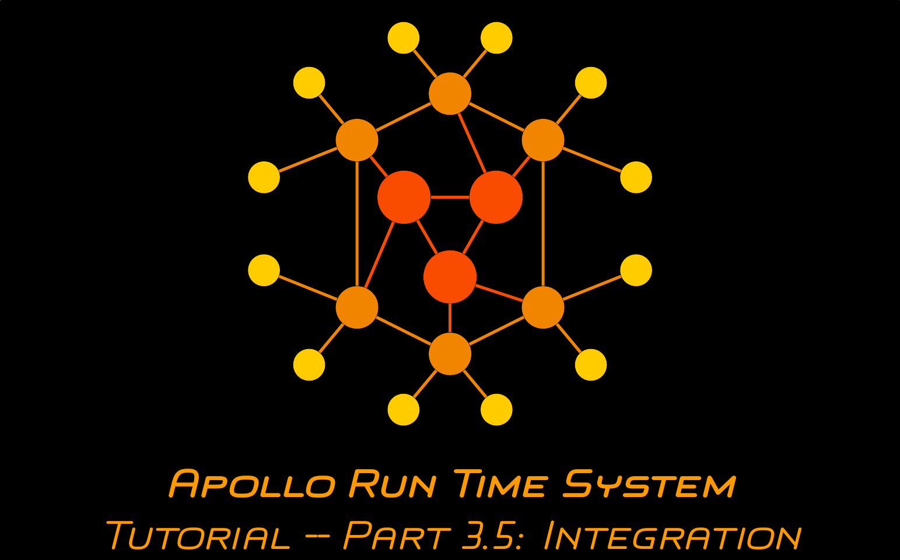

# Apollo Run Time System Tutorial -- Part 3: Implementing and Deploying Function Code as a Docker Image

This repository provides a Java project which can be used to conveniently run the caesar cipher application implemented throughout the first 3 parts of the Apollo tutorial.

## Video

The content and a walkthrough for this part of the tutorial is provided in the following video (click the image):

## Content

A Java project with the necessary dependencies and files to orchestrate the caesar cipher application using the files created in the previous steps of the tutorial.