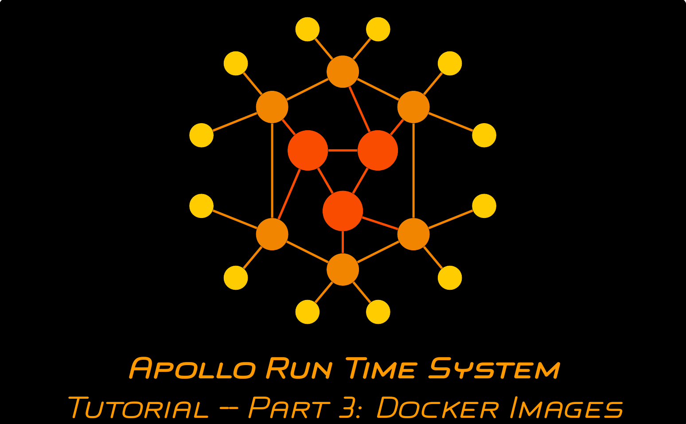

# Apollo Run Time System Tutorial -- Part 3: Implementing and Deploying Function Code as a Docker Image

This repository provides a possible solution for the third part of the tutorial series on the Apollo Run Time System. In this tutorial, you will use [Apollo's deployment process](https://github.com/Apollo-Functions/FunctionTemplate) to implement and deploy the functions of the caesar cipher application as Docker images.

## Video

The content and a walkthrough for this part of the tutorial is provided in the following video (click the image):

## Content

### Start

This folder contains the directory used for deployment in the state it is expected to be after the steps in the [second part of the tutorial](https://github.com/Apollo-Core/Tutorial/tree/master/Part_2).

### Result

The ``typeMappings.json`` file which provides the information about the Docker images which can be used to run the functions of the caesar cipher application.