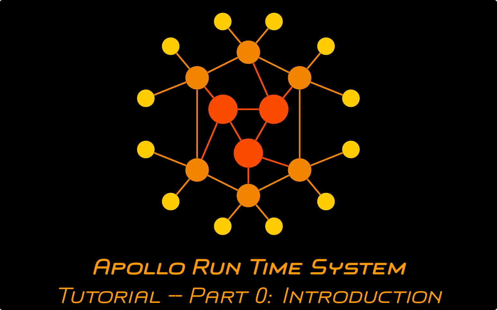

# Apollo Tutorial Series
This repository contains the solutions for the four parts of the Apollo tutorial series. An overview of the content and the learning goals of the tutorial is provided in the following video (click the picture):

## Repository Structure
The repository is structured into four parts which contain the "solutions" for the four parts of the tutorial. Each of the parts has its own README and guide video. It is recommended to do these tutorials in order.

Part # | Content | Link 
-------|---------|------
1 | Creating an AFCL workflow using Apollo's editor | [Link](https://github.com/Apollo-Core/Tutorial/tree/master/Part_1)
2 | Implementing and deploying function code on AWS | [Link](https://github.com/Apollo-Core/Tutorial/tree/master/Part_2)
3 | Implementing and deploying function code as a Docker image | [Link](https://github.com/Apollo-Core/Tutorial/tree/master/Part_3)
3.5 | Running the implemented application | [Link](https://github.com/Apollo-Core/Tutorial/tree/master/Part_3.5)
4 | Modifying Apollo's (scheduling) behavior | TBD
